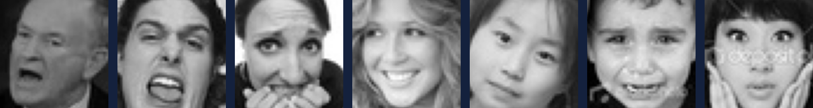
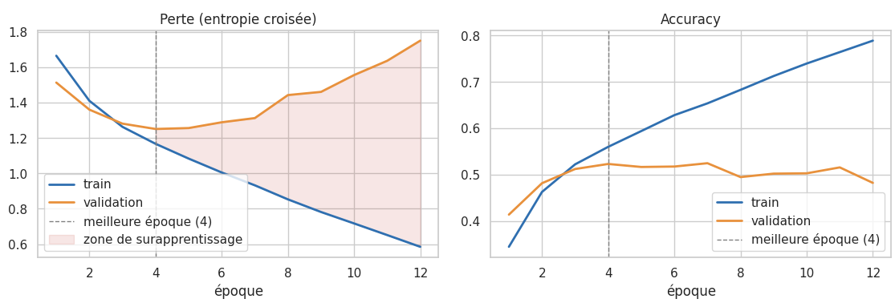
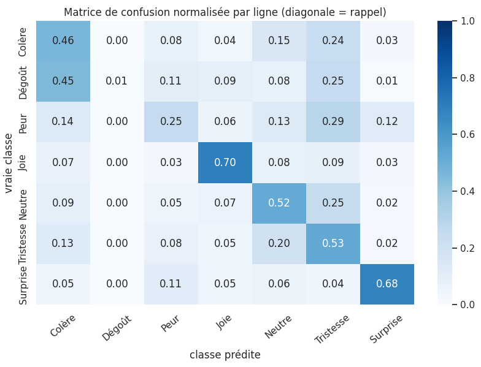

# Reconnaissance d'expressions faciales par Deep Learning

Projet universitaire de Deep Learning : classer un visage dans l'une des **7 émotions de base** (colère, dégoût, peur, joie, tristesse, surprise, neutre) à partir du jeu de données **FER-2013**. Le projet commence par un réseau dense de référence et va jusqu'à l'annotation automatique de plusieurs visages, d'abord sur des photos puis dans une vidéo.

## Contenu du dépôt

| Fichier | Description |
|---|---|
| `Projet_Expressions_Faciales.ipynb` | Notebook complet (Parties 1 à 9), avec les sorties et les analyses rédigées |
| `presentation/Presentation_Expressions_Faciales.pdf` | Diapositives de la soutenance (5 min) |
| `images/` | Figures reprises dans ce README |
| `requirements.txt` | Bibliothèques Python utilisées |

## Démarche

| Partie | Contenu |
|---|---|
| 1 | Données FER-2013 (48×48, niveaux de gris) : exploration, normalisation, encodage one-hot, validation stratifiée de 15 % |
| 2 | Modèle de référence : Flatten → Dense → Softmax (591 879 paramètres) |
| 3 | CNN : 3 blocs Conv 3×3 + MaxPool (32/64/128 filtres) → Dense 128 → Softmax (683 527 paramètres) |
| 4 | Entraînement : Adam (lr 1e-3), batch 64, EarlyStopping, ModelCheckpoint |
| 5 | Évaluation : matrice de confusion, précision, rappel, F1 par classe, calibration |
| 6 | Expériences : Dropout, BatchNorm, augmentation, poids de classes, 4ᵉ bloc, taux d'apprentissage |
| 7 | Transfer learning (MobileNetV2 ImageNet + fine-tuning) et régularisation L2 |
| 8 | Détection de plusieurs visages avec **YOLOv8n-face**, puis classification de chaque visage |
| 9 | Vidéo : suivi des visages (ByteTrack), lissage temporel (EMA, α = 0,3), vidéo annotée |

## Résultats principaux

| Modèle | Validation | Test |
|---|---|---|
| Réseau dense de référence | 38,1 % | 39,1 % |
| CNN de base | 52,3 % | **53,0 %** (F1 macro 0,447) |
| CNN + Dropout (E1, meilleure expérience) | **57,1 %** (F1 macro 0,509) | — |
| Combinaison Dropout + augmentation + poids de classes | F1 macro 0,426 | 48,6 % |
| MobileNetV2 (transfer learning) | 51,6 % (F1 macro 0,440) | 52,4 % (F1 macro 0,446) |
| CNN + régularisation L2 | 53,3 % (F1 macro 0,451) | — |

Ces résultats sont en dessous de la performance humaine estimée sur FER-2013 (≈ 65 %), qui reste un jeu de données difficile : images petites et bruitées, annotations parfois ambiguës, classe « dégoût » très minoritaire.

  
  

**Vidéo (Partie 9).** Sur une vidéo de test de 54 s, le lissage temporel ramène le nombre de changements d'expression affichés de 197 à 65. Le traitement prend environ 131 ms par image (≈ 7,6 images/s).

## Lancer le notebook (Google Colab)

1. Ouvrir `Projet_Expressions_Faciales.ipynb` dans Colab, puis choisir `Exécution > Modifier le type d'exécution > GPU (T4)`.
2. Autoriser l'accès à Google Drive quand le notebook le demande. Les résultats sont enregistrés dans `MyDrive/projet_dl/`.
3. Les données sont téléchargées automatiquement avec `kagglehub` (`msambare/fer2013`). Aucun fichier n'est à fournir.
4. Lancer `Exécution > Tout exécuter`. Les Parties 1 à 7 prennent environ 1 h 30.
5. **Redémarrer la session avant la Partie 8** (`Exécution > Redémarrer la session`), puis exécuter les Parties 8 et 9. TensorFlow et PyTorch ne peuvent pas cohabiter dans la même session, c'est pourquoi les Parties 8 et 9 utilisent Keras avec le backend `torch`.
6. Pour les démonstrations, déposer au préalable :
   - des photos dans `MyDrive/projet_dl/images_test/` (Partie 8) ;
   - une vidéo dans `MyDrive/projet_dl/videos_test/` (Partie 9).

Chaque partie relit les résultats de la précédente depuis le Drive. En cas de déconnexion, il suffit donc de reprendre à la partie interrompue.

## Technologies

TensorFlow / Keras · PyTorch · Ultralytics YOLOv8 · OpenCV · scikit-learn · pandas · Matplotlib / Seaborn

## Références

- FER-2013 : Goodfellow et al., *Challenges in Representation Learning*, ICML 2013 Workshop ([Kaggle](https://www.kaggle.com/datasets/msambare/fer2013))
- MobileNetV2 : Sandler et al., CVPR 2018
- YOLOv8-face : [akanametov/yolo-face](https://github.com/akanametov/yolo-face), entraîné sur WIDER FACE
- ByteTrack : Zhang et al., ECCV 2022
